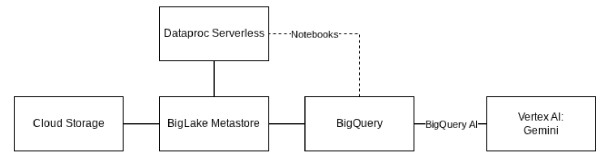

# Google Cloud Open Lakehouse with Apache Iceberg

## Introduction

Welcome to DataFuture Corp. We are officially transitioning from our legacy data warehousing solution to a modern, open Data Lakehouse architecture. Our goal is to achieve the high-performance analytics typical of BigQuery while maintaining the flexibility of open standards. This ensures that diverse engines—such as Spark and Trino—can access a single source of truth simultaneously, eliminating the need for costly data duplication.

We have selected Apache Iceberg as our foundational table format. It provides the enterprise-grade features we require, including:

- ACID Transactions: Ensuring data integrity across concurrent writes.  
- Schema Evolution: Modifying tables without breaking downstream queries.  
- Time Travel: Querying historical snapshots for audits or rollbacks.  
- AI Readiness: Seamlessly integrating with machine learning workflows by providing high-performance data fetches for model training and supporting vectorized reads for AI-driven analytics.

Your team is tasked with building the bedrock of this platform on Google Cloud. You will begin by configuring the storage layer and conclude by demonstrating true multi-engine and AI interoperability.

*Architecture diagram for the challengesi in this gHack.*

## Learning Objectives 

This hack will help you explore the following tasks:

- Configuring BigLake for open table formats  
- Creating and managing Iceberg tables using BigQuery  
- Performing DML operations (ACID transactions) on Iceberg tables  
- Utilizing time travel for historical data analysis  
- Managing security with fine-grained access control  
- Interacting with Iceberg tables using Dataproc (Spark)  
- Integrating Iceberg data directly with Gemini models for AI use cases

## Challenges

- Challenge 1: The open foundation  
- Challenge 2: Data interoperability across Lakehouse  
- Challenge 3: Schema evolution and time travel  
- Challenge 4: Fine-grained access control  
- Challenge 5: Multi-engine polyglot  
- Challenge 6: AI with multi-modal analysis

## Prerequisites

- Basic knowledge of Google Cloud Platform (BigQuery, Cloud Storage)  
- Basic knowledge of SQL  
- Basic understanding of Python/Spark is helpful but not mandatory

## Contributors

- Peter Bavinck
- Steve Loh
- Kelly Vehent

## Challenge 1: The Open Foundation

### Introduction 

Before we can analyze data, we need to lay the groundwork. Unlike standard BigQuery native tables, Iceberg tables store data in open formats (Parquet, Avro, ORC) in blob storage, such as Cloud Storage buckets, while BigQuery manages the metadata. This separation of compute and storage is the heart of the Lakehouse architecture.

### Description 

In BigQuery, we aim to have 2 datasets. One for *marketing* and one for *sales*. Your task is to create the *sales* dataset and the necessary tables.

You have been provided with raw sales data stored in a bucket on Google Cloud Storage. In this bucket, you will find the necessary data to create tables for orders, order\_items and products. First, create a **new** Cloud Storage bucket to serve as our data lake storage. Then, configure a **BigLake Connection** (Cloud Resource) to allow BigQuery to access this bucket. Finally, create the *sales* BigQuery dataset and 3 Iceberg tables, located within the bucket you created earlier, named `products`, `orders` and `order_items`. Finally, load the raw data into the Iceberg tables.

The schema of the three tables are as follows:

#### Schema files:
You can find the schema in JSON format for these tables in the following links:
- [orders](./resources/orders.json)
- [order\_items](./resources/order_items.json)
- [products](./resources/products.json)

### Success Criteria

- A Cloud Storage bucket exists in the same region as your dataset.  
- A BigLake Cloud Resource connection is successfully created and has the required permissions to access the bucket.  
- The tables `products`, `orders` and `order_items` exist, and their `table_format` is listed as `ICEBERG`.  
- Querying the Iceberg tables returns data.

### Learning Resources

- [Introduction to BigLake tables](https://cloud.google.com/bigquery/docs/biglake-intro)  
- [Create and set up a Cloud resource connection](https://docs.cloud.google.com/bigquery/docs/create-cloud-resource-connection)  
- [Create Iceberg tables in BigQuery](https://cloud.google.com/bigquery/docs/iceberg-tables)

### Tips

- Pay close attention to **Regions**. Your Bucket, Connection, and Dataset must all be in the same location (e.g., `us-central1`).  
- You will need to grant specific IAM roles on your Storage Bucket to the Service Account created by the BigLake connection.

## Challenge 2: Data interoperability across Lakehouse

### Introduction 

A cornerstone of the Google Cloud Lakehouse architecture is true interoperability: the ability to join disparate datasets without the latency or cost of data movement. Through BigLake, Google Cloud provides a unified interface that allows BigQuery to query Apache Iceberg tables alongside native BigQuery tables in a single SQL statement.

This architecture not only streamlines analytics but also serves as a robust foundation for AI integration. By storing data in open formats like Iceberg, you can feed cleaned, governed data directly into BigQuery’s AI capabilities without ever moving the underlying bits.

### Description 

Using the parquet file found in the raw data bucket on Cloud Storage, create a native BigQuery table called users in the marketing dataset. You should not need to define the table schema since BigQuery can automatically infer it from the parquet file.

Leverage the BigLake metadata layer to join your new users table with the existing Iceberg  tables. Write a single SQL query to aggregate the following metrics by country:

- Total number of orders   
- Total number of ordered items   
- Total sales price

### Success Criteria

- A BigQuery native table “users” is created with 100,000 rows.  
- Query output contains 1 row per country, and each row has 3 columns that contain the correct metrics.

### Learning Resources

- [Loading Parquet data from Cloud Storage](https://docs.cloud.google.com/bigquery/docs/loading-data-cloud-storage-parquet)  
- [BigQuery Query syntax](https://docs.cloud.google.com/bigquery/docs/reference/standard-sql/query-syntax)

## Challenge 3: Schema evolution and time travel

### Introduction 

In traditional data lakes, renaming a column or updating a specific row often requires a "rewrite-and-replace" of the entire dataset. Apache Iceberg eliminates this overhead by managing metadata at the file level and supporting full ACID transactions. Using standard BigQuery SQL, you can perform granular updates without disrupting concurrent readers.

Beyond simple updates, Iceberg provides a safety net through Time Travel. Because every change creates a new immutable snapshot, you can query the table exactly as it existed at a previous specific point in time.

### Description 

**1\. Clean up the product category**

The products table contains inconsistent naming conventions in the category column. Standardize the records by merging overlapping categories:

- The category 'Socks & Hosiery' and 'Socks' are overlapping. Update 'Socks & Hosiery' to simply 'Socks'.  
- The category 'Pants & Capris' and 'Pants' are overlapping. Update 'Pants & Capris' to simply 'Pants'.

**2\. Add a new column and set its value**

Business requires a new flag to track order verification.

- Evolve the schema by adding a new boolean column named is\_verified to the orders table.  
- Set this value to FALSE for all records where an order was returned, and TRUE for all other records.

**3\. Time travel with Iceberg travel**

Accidents happen. Data gets deleted or updated incorrectly. Use Time Travel to run a SQL query which calculates the average retail price of products with category \= 'Pants & Capris' (which you have just updated to "Pants").

### Success Criteria

- A SELECT DISTINCT on the category column shows no instances of "Socks & Hosiery" or "Pants & Capris."  
- The orders table contains the is\_verified column with the correct boolean logic applied.  
- The Time Travel query successfully returns a correct average retail price for the now-deleted "Pants & Capris" category.  
- Additional metadata files have been created in the GCS folders of those tables that have been updated.

### Learning Resources

- [DML syntax in BigQuery](https://cloud.google.com/bigquery/docs/reference/standard-sql/dml-syntax)  
- [Time travel with Iceberg tables](https://cloud.google.com/bigquery/docs/iceberg-tables#time_travel)  
- [FOR SYSTEM\_TIME AS OF clause](https://cloud.google.com/bigquery/docs/reference/standard-sql/query-syntax#for_system_time_as_of)

## Challenge 4: Fine-grained access control

### Introduction 

In a modern Lakehouse, flexibility must be balanced with rigorous security. As we consolidate data into Apache Iceberg, protecting Personally Identifiable Information (PII) becomes a top priority.

Using BigLake and Data Catalog, you can enforce "Zero Trust" security directly on your Iceberg tables. By applying Data Masking and Column-Level Security, you ensure that sensitive fields like email addresses or pricing data are obscured by default. This is a foundational step for Responsible AI, preventing sensitive data from leaking into LLM prompts or being used improperly during model training.

### Description 

Create a new taxonomy called "Sensitive Data" in the us-central1 region with 2 data policies:

- Confidential: using the default masking rule.  
- Email: using the email masking rule.

Apply the newly created data policies to the tables:

- Attach the Confidential data policy to products.retail\_price.  
- Attach the Email data policy to users.email.  
- Run a SQL query to select these columns. Are you able to read the data?

Assign the appropriate permissions to read the columns.

- Add the Masked Reader role to your user and check if you can see the masked value.  
- Add the Fine-Grained Reader role to your user, and check if you can see the original value.

### Success Criteria

- Column level security is applied correctly on the products and users tables.  
- You are able to read the masked and unmasked data when using the appropriate roles.

### Learning Resources

- [Mask data by applying data policies](https://docs.cloud.google.com/bigquery/docs/column-data-masking#data-policies-on-column)  
- [Masking rules](https://docs.cloud.google.com/bigquery/docs/reference/bigquerydatapolicy/rest/v2/projects.locations.dataPolicies#PredefinedExpression)  
- [How Masked Reader and Fine-Grained Reader roles interact](https://docs.cloud.google.com/bigquery/docs/column-data-masking-intro#role-interaction)

## Challenge 5: Multi-engine polyglot

### Introduction 

A true Data Lakehouse isn't tied to one engine. To demonstrate the architecture is open, we modify the data using a completely different compute engine: Apache Spark.

### Description 

We are going to use Dataproc Serverless via a BigQuery Notebook to easily combine Spark with BigQuery. 

The first step is to create a new notebook in BigQuery so you can start writing Spark SQL. At this time, you need to provide an additional instruction to explicitly export the table metadata for our tables to GCS. In the future, this will no longer be necessary as it will be done automatically. Add these instructions early on to your Notebook.

Next, we create an interactive Spark session to use for our querying.

Now that we have the setup done, we can query our BigQuery managed Iceberg tables using Spark. For each product brand, calculate the total revenue, the total profit, and the "Return Rate." This will help identify which brands are the most profitable and which might have quality issues causing a high rate of returns.

Requirements:  
- Only include items where the order status is not 'Cancelled'.  
- Revenue: Sum of sale\_price from order\_items.  
- Profit: Sum of (sale\_price from order\_items minus cost from products).  
- Return Rate: The percentage of items where returned\_at is not null.  
- Filter the final results to only show brands that have generated at least $500 in total revenue.  
- Order the results by Profit in descending order.

### Success Criteria

- A Dataproc Serverless session is started in a BigQuery Notebook  
- The total revenue, total profit and the return rate percentages are calculated. The return rates should be between 7% \- 15%.

### Learning Resources

- [Export table metadata](https://docs.cloud.google.com/bigquery/docs/exporting-data#export_table_metadata)  
- [Create a Spark session in a BigQuery Studio notebook](https://docs.cloud.google.com/bigquery/docs/use-spark#create-a-single-spark-session-in-a-bigquery-studio-notebook)

### Tips

- Create the Spark session with version 2.3 (using the runtime\_config) and the available subnet (using environment\_config.execution\_config)  
- A Notebook runtime template is available to you. Make sure you create your runtime based on this template.

## Challenge 6: AI with multi-modal analysis

## Introduction

In a modern Lakehouse, data isn't just rows and columns; it’s also unstructured data like images, PDFs, and audio. Google Cloud enables "multi-modality" by allowing BigQuery to manage and analyze unstructured data through **Object Tables**. By using **BigQuery AI** and pre-trained models (like Gemini or specialized vision models), we can extract insights from images—such as identifying defects in returned items—and join those insights directly with our Iceberg tables.

## Description

A batch of images representing returned products has been uploaded to your Google Cloud Storage bucket in the `/return_images/` folder. Each filename corresponds to a product ID. Your goal is to analyze these images and extract a description of the faulty product and correlate this information with our product catalog.

1. **Create an Object Table**: Create an external Object Table in BigQuery that points to the images in your Cloud Storage bucket. You can use the same BigLake connection created in Challenge 1\.  
2. **Join product and image data**: Create a new table that brings the structured product data (backed by Iceberg) and the image metadata (Object table) together in a single table that contains a column using the ObjectRef data type.  
3. **Perform Multi-modal Analysis**: Write a SQL query that uses the `AI.GENERATE` function to describe the condition of the products in the return images.

## Success Criteria

- An Object Table is successfully created and lists the URIs of the return images.  
- A single table exists combining product and image metadata using the ObjectRef data type.  
- A SQL query successfully processes the images and returns a text description of the condition of the returned item.

## Learning Resources

- [Introduction to Object Tables](https://cloud.google.com/bigquery/docs/object-table-introduction)  
- [Analyze multimodal data in BigQuery](https://docs.cloud.google.com/bigquery/docs/analyze-multimodal-data)  
- [Analyze images with a Gemini model](https://docs.cloud.google.com/bigquery/docs/image-analysis)
